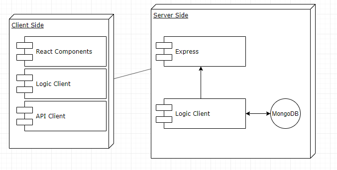
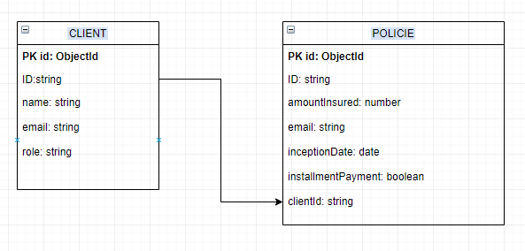
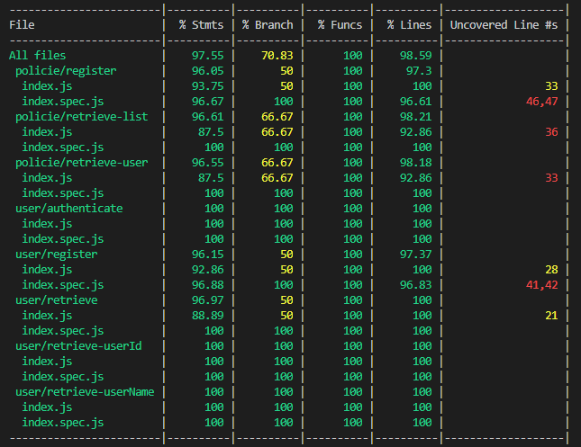

# AXA API

A project by: 
*Albet Fuente*

## INTRODUCTION
This is a REST APP that manages information regarding insurance policies and company clients.
There is a lits of company clients and a list of company policies.

The API can:
* register clients an authenticate them.
* register policies.

With the database of clients and policies the API can:
* retrieve user data filtered by user id
* retrieve user data filtered by user name
* retrieve list of policies linked to a user name(only users with role admin)
* retrieve the user linked to a policy number (only users with role admin)

In order to run the API use the command node . inside the axa-api folder.
In order to run the APP use the command yarn start inside the axa-app folder.

## Functional description

**USE CASES**

Admin case

User case

**FLOW CHART**

Admin

User

## Technical description

**BLOCK DIAGRAM**

**COMPONENTS**

**DATA MODEL**

**CODE COVERAGE**

**TECHNOLOGIES**

Back end: Node.js, Express,Mocha Chai, MongoDB & Mongoose.

Front end: Node.js, React, Sass
